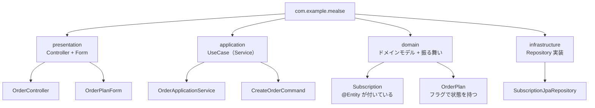

「ドメイン駆動設計を意識して実装しているのに、コードが複雑になっていく一方だ」——そんな経験はありませんか？

新機能を追加するたびに `Form` クラス、`Command` クラス、`Entity` クラスが増え続け、それらをつなぐ「詰め替え」コードが至るところに現れる。バリデーションはどこに書くべきかで議論になり、ドメインモデルは `@Entity` と `@NotNull` と業務ロジックを同時に背負って肥大化していく。

設計の意図を理解したはずなのに、コードはなぜこうなるのでしょうか。

この本は、その問いに答えるために書きました。問題は設計パターンそのものではなく、「バリデーションの知識」「永続化の知識」「型変換の知識」が、それぞれ**あるべき場所に置かれていない**ことにあります。

本書では、ミールス宅配サービスという架空のドメインを題材にしながら、次の3つのアプローチを段階的に示します。

1. **Parse, Don't Validate**（パースしてバリデーションと型変換を同時に行う）
2. **Always-Valid Layer**（常に正しいデータだけが流れる層を作る）
3. **Balanced Coupling**（レイヤー間の結合強度と距離を釣り合わせる）

これらを組み合わせることで、「ドメインモデルはただの `record` でいい」という状態——バリデーションも永続化も状態チェックも知らない純粋なデータ構造——が実現できます。

まず、古典ドメインモデリングパターンがどのように見えるかを確認しましょう。

---

## 本書で「古典ドメインモデリングパターン」と呼ぶもの

本書のタイトルにある「古典ドメインモデリングパターン」は、次の3要素がセットになった構成を指します。

- `@Entity` がドメイン層のクラスに直接付与され、永続化の知識をドメインモデルが担っている
- Bean Validation のフォームクラスを境界に置き、`@NotNull` などのアノテーションでバリデーションを表現している
- レイヤー間の受け渡しに `Form` → `Command` → ドメインモデル → `Entity` といった専用 DTO による詰め替えが発生する

いずれも単体では悪ではありません。問題は、この3要素が組み合わさると「どのクラスが何の責務を持つか」が曖昧になり、変更のたびに複数のクラスを同時に修正する必要が生じる点です。本書はこの組み合わせからの解脱を扱います。

## ミールス宅配サービスのドメイン

この本を通じて使うドメインを最初に示します。ミールス宅配サービス（架空）の注文と定期便管理です。

### 注文（Order）

利用者はプランを選んで注文します。プランには3種類あります。

- **スタンダードプラン**: 食事セットを1つ選びます。配送頻度を指定します。
- **プレミアムプラン**: 食事セットを1つ選びます。冷凍食材を含めるか選択できます。配送頻度を指定します。
- **カスタムプラン**: 食材を複数選んで組み合わせます。配送頻度と開始日を指定します（開始日は3日以上先）。

### 定期便（Subscription）

注文が完了すると定期便が作られます。定期便には「アクティブ」と「一時停止」の2つの状態があります。

- **アクティブ**: 定期的に食材が届きます。次回配送日を持ちます。
- **一時停止**: 配送を止めている状態です。次回配送日は持ちません。

アクティブな定期便を「一時停止」にでき、一時停止した定期便を「再開」（アクティブに戻す）できます。

---

このドメインを、古典ドメインモデリングパターンで実装するとどうなるか見てみましょう。

## 典型的なレイヤー構成

よく見かける構成はこうです。



各レイヤーが独自のモデルを持ち、UseCase の入出力には専用の Command/Data オブジェクトを使います。これが Full Mapping です。

## 各レイヤーのコード

この構成が実際にどのようなコードになるか、各レイヤーごとに見ていきます。

### プレゼンテーション層（Form + Controller）

```java
@Data
@ValidOrderPlanForm   // カスタムバリデーション
public class OrderPlanForm {
    @NotBlank
    @Pattern(regexp = "STANDARD|PREMIUM|CUSTOM")
    private String planType;

    private String mealSetId;       // STANDARD / PREMIUM のみ
    private Boolean includeFrozen;  // PREMIUM のみ
    private List<String> mealIds;   // CUSTOM のみ
    private String frequency;
    private LocalDate startDate;    // CUSTOM のみ
}
```

```java
@PostMapping("/orders")
public ResponseEntity<?> createOrder(
        @Valid @RequestBody OrderPlanForm form,
        BindingResult bindingResult) {
    if (bindingResult.hasErrors()) {
        return ResponseEntity.badRequest().body(bindingResult.getAllErrors());
    }
    // Form → Command への詰め替え（1回目）
    CreateOrderCommand command = new CreateOrderCommand(
            currentUserId(),
            form.getPlanType(),
            form.getMealSetId(),
            form.getIncludeFrozen(),
            form.getMealIds(),
            form.getFrequency(),
            form.getStartDate()
    );
    orderApplicationService.createOrder(command);
    return ResponseEntity.status(201).build();
}
```

### アプリケーション層（UseCase + Command）

```java
// UseCase の入力を表す DTO
public class CreateOrderCommand {
    private final String userId;
    private final String planType;
    private final String mealSetId;
    private final Boolean includeFrozen;
    private final List<String> mealIds;
    private final String frequency;
    private final LocalDate startDate;
    // コンストラクタ + getter ...
}
```

```java
@Service
public class OrderApplicationService {
    public void createOrder(CreateOrderCommand command) {
        // Command → ドメインモデルへの詰め替え（2回目）
        OrderPlan plan = buildPlan(command);
        String subscriptionId = UUID.randomUUID().toString();
        LocalDate nextDelivery = LocalDate.now().plusWeeks(1);
        Subscription subscription = new Subscription();
        subscription.setId(subscriptionId);
        subscription.setUserId(command.getUserId());
        subscription.setStatus(SubscriptionStatus.ACTIVE);
        subscription.setNextDeliveryDate(nextDelivery);
        // ...
        subscriptionRepository.save(subscription);
    }

    private OrderPlan buildPlan(CreateOrderCommand command) {
        // planType の文字列で分岐して詰め替え
        return switch (command.getPlanType()) {
            case "STANDARD" -> new OrderPlan(
                    command.getMealSetId(), command.getFrequency(), null, null, null);
            case "PREMIUM" -> new OrderPlan(
                    command.getMealSetId(), command.getFrequency(),
                    command.getIncludeFrozen(), null, null);
            case "CUSTOM" -> new OrderPlan(
                    null, command.getFrequency(), null,
                    command.getMealIds(), command.getStartDate());
            default -> throw new IllegalArgumentException("Unknown plan type");
        };
    }
}
```

### ドメイン層（バリデーションと永続化の知識が混入）

```java
@Entity
@Table(name = "subscriptions")
public class Subscription {

    @Id
    private String id;

    @NotNull
    private String userId;

    @Enumerated(EnumType.STRING)
    @NotNull
    private SubscriptionStatus status;

    private LocalDate nextDeliveryDate; // ACTIVE のときのみ意味を持つ

    protected Subscription() {}

    public void suspend() {
        if (this.status == SubscriptionStatus.SUSPENDED) {
            throw new IllegalStateException("すでに一時停止中です");
        }
        this.status = SubscriptionStatus.SUSPENDED;
        this.nextDeliveryDate = null;
    }

    // getters / setters ...
}
```

```java
// プランもフラットなクラス。プランの種類によらず全フィールドを持つ
public class OrderPlan {
    private String mealSetId;       // STANDARD / PREMIUM のみ使う
    private String frequency;
    private Boolean includeFrozen;  // PREMIUM のみ使う
    private List<String> mealIds;   // CUSTOM のみ使う
    private LocalDate startDate;    // CUSTOM のみ使う
    // ...
}
```

## 何が起きているか

コードを追うと、次のことが見えてきます。

**詰め替えの回数**: HTTP リクエストから DB 書き込みまでに、少なくとも3回の詰め替えが発生しています。`OrderPlanForm` → `CreateOrderCommand` → `Subscription` → JPA がテーブルにマッピング、という流れです。

**型の曖昧さ**: `OrderPlanForm` でバリデーションが通った後も、型は `OrderPlanForm` のままです。`planType = "STANDARD"` のとき `mealSetId` が null かどうかは、実行時にしかわかりません。バリデーションが通過した後も、防御的な null チェックや `planType` による分岐が各所に現れます。

**ドメインモデルの重さ**: `Subscription` クラスは `@Entity`、`@Table`、`@NotNull`、状態チェックのロジックをすべて持っています。データベースの知識と Jakarta Validation の知識とドメインロジックが1つのクラスに混在しています。

次章では、この構成の問題を整理します。

---

この構成（Full Mapping）は、複数チームが並行開発する大規模システムや、レイヤーを独立してデプロイするシステムでは、レイヤー間の契約を明確にできるという利点があります。

しかし単一チームが同一コードベースを管理する一般的な Web アプリケーションでは、詰め替えのコストに対して得られる独立性の恩恵が釣り合わないことがあります。問題は構成そのものではなく、**適用する状況を問わずこのパターンを使い続けること**です。

次章では、この構成の問題を3つに整理します。そしてその問題を解消していくと、最終的にどんな構造に行き着くかが見えてきます。
