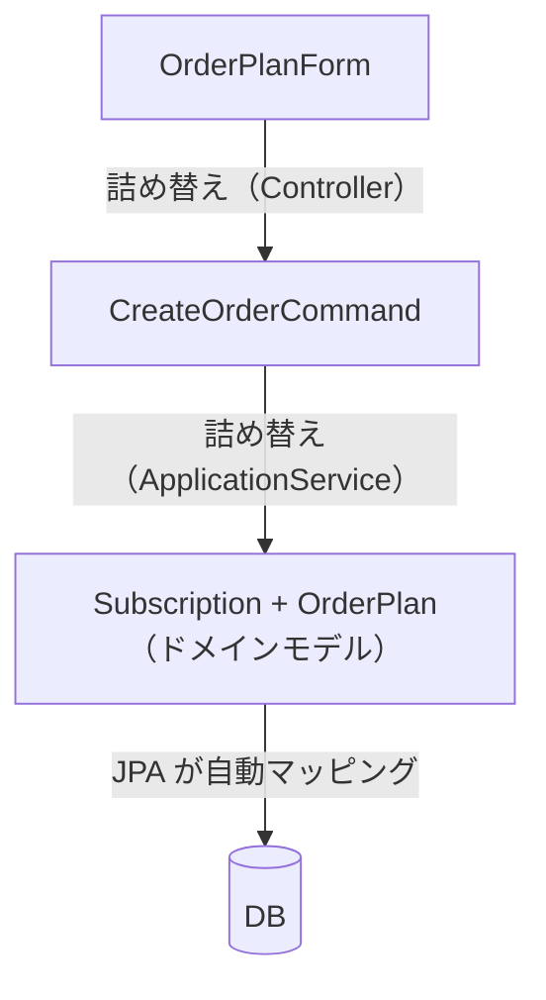
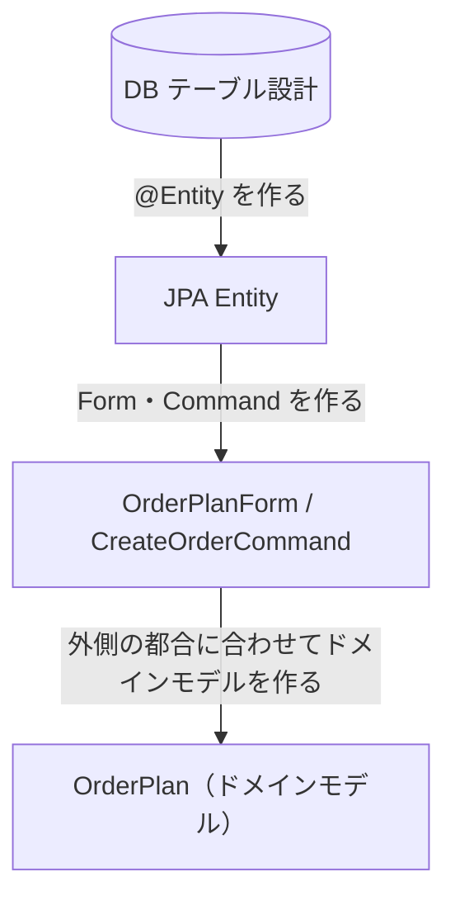

## こんな場面、ありませんか

前章で示した構成を使っていると、次のような場面に出くわすことがあります。

- フィールドを1つ追加しただけなのに、`OrderPlanForm`・`CreateOrderCommand`・`OrderPlan` の3クラスと、それぞれの詰め替えコードを修正しなければならない
- `@Validated` でバリデーションを通過したはずなのに、その直後でまたプランタイプを `switch` で確認している
- `Subscription` の状態遷移をテストしようとしたら、Spring Context が必要になった

これらは別々の原因に見えますが、根は同じところにあります。3つに整理します。

## バリデーションを通過しても、その先でまた分岐が必要になる

Bean Validation でバリデーションを通過した後も、変数の型は変わりません。

```java
// バリデーション通過後の状態
OrderPlanForm form; // planType = "STANDARD"
```

`planType = "STANDARD"` のとき、`mealSetId` は必ず存在し `mealIds` は null のはずです。しかしそれは **バリデーションロジックの中だけで保証された知識** であり、`OrderPlanForm` という型には反映されていません。

その結果、`form` を受け取ったコードはすべて、どのプランなのかをもう一度確認しなければなりません。

```java
// バリデーション通過後でも、各所で再チェックが必要
private OrderPlan buildPlan(CreateOrderCommand command) {
    return switch (command.getPlanType()) { // 文字列で再分岐
        case "STANDARD" -> ...;
        case "PREMIUM"  -> ...;
        case "CUSTOM"   -> ...;
        default -> throw new IllegalArgumentException(...); // 実行時エラー
    };
}
```

コンパイラはこの分岐が網羅的かどうかを確認できません。`"CUSTOM"` のスペルミスも、`"PREMIUM"` の処理の漏れも、実行時にしか発覚しません。

## フィールド1つの追加が、複数クラスの修正に波及する

HTTP リクエストから DB 書き込みまでに、手書きの型変換が2箇所、JPA の自動マッピングを含めると3箇所で詰め替えが発生します。



各詰め替えのコードは、それ自体はシンプルな値コピーです。しかし積み重なると、「何をやっているかわかるコード」の大半が「値をコピーするだけのコード」になります。

さらに、詰め替えは変更の波及点になります。たとえば配送エリアを表す `deliveryRegion` フィールドをプランに追加するとします。

```java
// 1. OrderPlanForm にフィールドを追加
private String deliveryRegion;

// 2. CreateOrderCommand にフィールドを追加
private final String deliveryRegion;

// 3. Controller の詰め替えコードを修正
CreateOrderCommand command = new CreateOrderCommand(
    currentUserId(),
    form.getPlanType(),
    form.getMealSetId(),
    form.getIncludeFrozen(),
    form.getMealIds(),
    form.getFrequency(),
    form.getStartDate()
    // deliveryRegion を追加し忘れた ← コンパイルエラーにならない場合がある
);
```

コンストラクタの引数順によっては、追加し忘れても `null` が渡るだけでコンパイルエラーになりません。この `null` は `OrderPlan` を組み立てる `buildPlan()` を通り抜け、DB に保存され、配送処理で初めて問題が顕在化します。修正からバグ発覚まで時間差があるほど、原因の特定が難しくなります。

## ドメインモデルのテストに、フレームワークの起動が必要になる

`Subscription` クラスを見ると、1つのクラスが複数の関心を背負っています。

```java
@Entity                       // 永続化の関心
@Table(name = "subscriptions")
public class Subscription {

    @NotNull                  // バリデーションの関心
    private String userId;

    @Enumerated(EnumType.STRING)
    private SubscriptionStatus status;

    private LocalDate nextDeliveryDate;

    public void suspend() {
        if (status == SUSPENDED) {   // 状態管理の関心
            throw new IllegalStateException(...);
        }
        this.status = SUSPENDED;
        this.nextDeliveryDate = null;
    }
}
```

このクラスを変更する理由が複数あります。

- テーブル構造が変わった → `@Column` を修正
- バリデーションルールが変わった → `@NotNull` などを修正
- 状態遷移の仕様が変わった → `suspend()` の中を修正

複数の理由で変更されるクラスは、変更が衝突します。また、このクラスを単体テストしようとすると Spring Context や JPA の設定が必要になることがあります。

## 3つの問題に共通する根

これらの問題は、それぞれ独立した課題に見えますが、根は同じです。

**バリデーション・型変換・永続化の知識が、あるべき場所に置かれていません。**

- バリデーションの知識がドメインモデル（`@NotNull`）に混入しています
- 永続化の知識がドメインモデル（`@Entity`）に混入しています
- 型を確定させる知識がバリデーションクラスの中に閉じ込められ、外には漏れ出ません

なぜ知識が混入するのでしょうか。実装の出発点が関係しています。`@Entity` を先に作ると、ドメインモデルはその型に合わせる形で後から作られます。合わせる以上、永続化の都合（`@Entity`）がドメインモデルに残るのは構造上避けにくくなります。

ORM（JPAなど）を採用すると、まずテーブル構造に対応する `@Entity` クラスを作ることが自然な出発点になります。次に HTTP リクエストを受け取る `OrderPlanForm` を作ります。最後にドメインモデル（`OrderPlan`）を作るころには、`@Entity` の構造や `Form` の構造に引きずられた形になります。



クリーンアーキテクチャやヘキサゴナルアーキテクチャの図でいう「外側」（HTTP・DB）から実装を始めるこのスタイルを、本書では**アウトサイドイン開発**と呼びます。外側から作ると、ドメインモデルは設計の起点ではなく「最後に埋める穴」になります。永続化の知識（`@Entity`）も、バリデーションの知識（`@NotNull`）も、外側の都合がドメインモデルに流れ込む形になります。

> **用語注**: BDD やクリーンアーキテクチャの文脈で用いられる「アウトサイドイン」は「UI やユースケースの受け入れテストから仕様を駆動して内側へ向かう」という方法論を指します。本書で言う「アウトサイドイン開発」は、**実装の出発点が外側のフレームワーク構造（`@Entity`・Form）にある状態**を指す狭い意味で使います。BDD 的な意味でのアウトサイドインは、本書の批判対象ではありません。

本書のアプローチは逆です。`OrderPlan sealed interface` のようなドメインの型から実装を始め、デコーダとリポジトリを「外側からドメインへの変換器」として後から設計します。この順序の違いが、3つの問題を構造的に解消します。

以下の解決策の詳細は3章以降で説明します。ここでは方向感の提示にとどめます。

| 問題 | 根本原因 | 解決策（本書のアプローチ） |
| --- | --- | --- |
| 型が確定しない | バリデーションと型変換が分離しています | デコーダが型変換とバリデーションを同時に行います（3〜5章で説明） |
| 詰め替えが多い | 各レイヤーで同じデータを別の型で持ち続けます。これは、どのレイヤーが `OrderPlan` を表す型の知識を持つべきかが定まっていないために起こります | 境界で一度変換し、ドメインモデルをそのまま受け渡します |
| ドメインモデルが重い | バリデーション・永続化の知識がドメインモデルに混入しています | 各知識をデコーダ・リポジトリに分散させます |

---

3章からは、この解決策を具体的に示します。まず「バリデーションと型変換の同時処理」から始めます。
