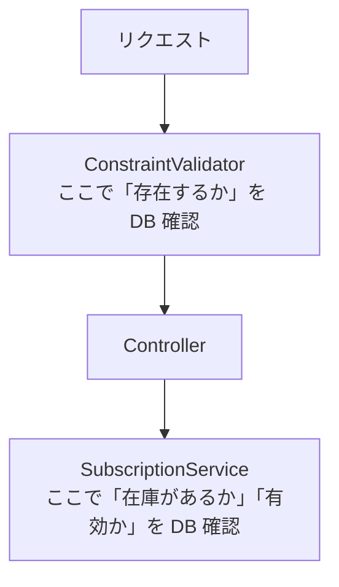

前章で示した `OrderPlan`（`StandardPlan`・`PremiumPlan`・`CustomPlan` の3種類）を、まず Bean Validation で実装してみましょう。プランの種類によって「必要なフィールド」が異なることが、バリデーションを難しくする核心的な問題です。

## Bean Validationによる実装

Spring MVC + Jakarta Bean Validation の標準的なやり方です。フォームクラス・カスタムバリデーター・コントローラーの3つで構成されます。

### フォームクラス

```java
@Data
@ValidOrderPlanForm   // カスタムバリデーションアノテーション
public class OrderPlanForm {

    // 共通フィールド
    @NotBlank(message = "プランタイプは必須です")
    @Pattern(regexp = "STANDARD|PREMIUM|CUSTOM",
             message = "プランタイプはSTANDARD、PREMIUM、CUSTOMのいずれかです")
    private String planType;

    @NotBlank(message = "配送頻度は必須です")
    @Pattern(regexp = "WEEKLY|BIWEEKLY",
             message = "配送頻度はWEEKLYまたはBIWEEKLYです")
    private String frequency;

    // STANDARD / PREMIUM で使うフィールド
    private String mealSetId;

    // PREMIUM のみで使うフィールド
    private Boolean includeFrozen;

    // CUSTOM のみで使うフィールド
    private List<String> mealIds;
    private LocalDate startDate;
}
```

フラットな1クラスに、3つのプランで使うフィールドがすべて同居しています。`mealSetId` はSTANDARDとPREMIUMで使いますが、CUSTOMでは使いません。`mealIds` と `startDate` はCUSTOMでしか使いません。各フィールドがどのプランで使われるかは、コメント（`// STANDARD / PREMIUM で使うフィールド`）でしか示されていません。型システムがこの関係を保証していないため、コメントが古くなったとき・コメントを見落としたときに誤った使い方が発生します。

### カスタムバリデーター

`@NotBlank` や `@NotNull` といったアノテーションは、単一フィールドの制約には使えます。しかし「プランタイプがSTANDARDのときは `mealSetId` が必須」という**条件付き必須**はアノテーションでは表現できません。これを書くには `ConstraintValidator` が必要になります。

```java
public class OrderPlanFormValidator
        implements ConstraintValidator<ValidOrderPlanForm, OrderPlanForm> {

    @Override
    public boolean isValid(OrderPlanForm form,
                           ConstraintValidatorContext context) {
        if (form == null || form.getPlanType() == null) {
            return true;
        }
        context.disableDefaultConstraintViolation();

        return switch (form.getPlanType()) {
            case "STANDARD" -> validateStandard(form, context);
            case "PREMIUM"  -> validatePremium(form, context);
            case "CUSTOM"   -> validateCustom(form, context);
            default -> true;
        };
    }

    private boolean validateStandard(OrderPlanForm form,
                                     ConstraintValidatorContext context) {
        boolean valid = true;
        if (form.getMealSetId() == null || form.getMealSetId().isBlank()) {
            addViolation(context, "mealSetId", "ミールセットは必須です");
            valid = false;
        }
        return valid;
    }

    private boolean validatePremium(OrderPlanForm form,
                                    ConstraintValidatorContext context) {
        boolean valid = true;
        if (form.getMealSetId() == null || form.getMealSetId().isBlank()) {
            addViolation(context, "mealSetId", "ミールセットは必須です");
            valid = false;
        }
        if (form.getIncludeFrozen() == null) {
            addViolation(context, "includeFrozen", "冷凍オプションの選択は必須です");
            valid = false;
        }
        return valid;
    }

    private boolean validateCustom(OrderPlanForm form,
                                   ConstraintValidatorContext context) {
        boolean valid = true;
        if (form.getMealIds() == null || form.getMealIds().isEmpty()) {
            addViolation(context, "mealIds", "食材を1つ以上選択してください");
            valid = false;
        }
        if (form.getStartDate() == null) {
            addViolation(context, "startDate", "開始日は必須です");
            valid = false;
        } else if (form.getStartDate().isBefore(LocalDate.now().plusDays(3))) {
            addViolation(context, "startDate", "開始日は3日以上先の日付を指定してください");
            valid = false;
        }
        return valid;
    }

    private void addViolation(ConstraintValidatorContext context,
                              String property, String message) {
        context.buildConstraintViolationWithTemplate(message)
                .addPropertyNode(property)
                .addConstraintViolation();
    }
}
```

### コントローラー

```java
@RestController
@RequestMapping("/api/subscriptions")
public class SubscriptionController {

    private final SubscriptionService subscriptionService;

    @PostMapping
    public ResponseEntity<?> create(
            @Validated @RequestBody OrderPlanForm form,
            BindingResult bindingResult) {

        if (bindingResult.hasErrors()) {
            List<Map<String, String>> errors = bindingResult.getFieldErrors().stream()
                    .map(e -> Map.of(
                            "field", e.getField(),
                            "message", e.getDefaultMessage()))
                    .toList();
            return ResponseEntity.badRequest().body(Map.of("errors", errors));
        }

        // バリデーション通過後もまだ OrderPlanForm のまま。
        // どのプランかを判定するために再度 switch が必要になる。
        OrderPlan plan = switch (form.getPlanType()) {
            case "STANDARD" -> new StandardPlan(
                    new MealSetId(form.getMealSetId()),
                    DeliveryFrequency.valueOf(form.getFrequency())
            );
            case "PREMIUM" -> new PremiumPlan(
                    new MealSetId(form.getMealSetId()),
                    DeliveryFrequency.valueOf(form.getFrequency()),
                    form.getIncludeFrozen()
            );
            case "CUSTOM" -> new CustomPlan(
                    form.getMealIds().stream().map(MealId::new).toList(),
                    DeliveryFrequency.valueOf(form.getFrequency()),
                    form.getStartDate()
            );
            default -> throw new IllegalStateException("unreachable");
        };

        String subscriptionId = subscriptionService.create(plan);
        return ResponseEntity.ok(Map.of("subscriptionId", subscriptionId));
    }
}
```

### JSON として解釈できないリクエスト

Bean Validation を使う構成でも、4章以降で示すデコーダ構成でも、「そもそも JSON として解釈できないリクエスト」への配慮は必要です。クライアントが `Content-Type: application/json` を付けずに送ってきたとき、JSON の構文が壊れているとき、`@RequestBody` が受け取るオブジェクトを組み立てる前の段階で Spring MVC は `HttpMessageNotReadableException` を投げます。この例外は `ConstraintValidator` にも Raoh デコーダにも届きません。

実務ではこれを `@ControllerAdvice` でまとめてハンドリングします。

```java
@RestControllerAdvice
public class GlobalExceptionHandler {

    @ExceptionHandler(HttpMessageNotReadableException.class)
    public ResponseEntity<?> handleUnreadable(HttpMessageNotReadableException e) {
        return ResponseEntity.badRequest()
                .body(Map.of(
                        "errors", List.of(Map.of(
                                "path", "",
                                "message", "リクエストボディを JSON として解釈できません"))));
    }
}
```

バリデーションエラー（`MethodArgumentNotValidException`）とフォーマットエラー（`HttpMessageNotReadableException`）は別々に発生しうるため、クライアント側が同一形式のエラーレスポンスを期待するなら、両方を同じ JSON スキーマに揃える工夫が必要です。12章の「移行時の落とし穴」でも、この点に再度触れます。

## 実装を続けると見えてくること

このBean Validationによる実装を複雑なドメインに使い続けると、いくつかの場面でコードが予想外の方向に向かいます。具体的には以下の4つの課題が現れます。

### フォームクラスに使われないフィールドが増えていく

`OrderPlanForm` はプランの種類にかかわらず全フィールドを持ちます。つまり「STANDARDプランなのに `mealIds` が入っている」「CUSTOMプランなのに `mealSetId` も `mealIds` も入っていない」といった状態が、クラスの構造上は許されてしまいます。

バリデーターがそれを弾いてくれるとはいえ、**型を見ただけでは不正な状態が排除されているとは分かりません**。

### バリデーション通過後に、もう一度プランタイプで分岐することになる

`@Validated` で検証が通ったとしても、コントローラーの手元にあるのは相変わらず `OrderPlanForm` です。「どのプランか」を知るには `getPlanType()` を呼んで文字列を確認するしかありません。

そのため、コントローラーでドメインモデルを組み立てるための **2回目の `switch` 文** が必要になります。バリデーターの `switch` と合わせて、同じ分岐ロジックがコードベースに2箇所存在することになります。

### 構造が深くなるほどバリデーターが膨らんでいく

今回の例はプランが3種類で浅い構造ですが、実際の業務では入れ子の分岐が生まれます。たとえば「CUSTOMプランの場合、配送エリアが北海道・沖縄なら追加料金の確認フラグが必要」といった条件が加わると、`validateCustom()` の中がこうなります。

```java
private boolean validateCustom(OrderPlanForm form,
                               ConstraintValidatorContext context) {
    boolean valid = true;
    if (form.getMealIds() == null || form.getMealIds().isEmpty()) {
        addViolation(context, "mealIds", "食材を1つ以上選択してください");
        valid = false;
    }
    if (form.getStartDate() == null) {
        addViolation(context, "startDate", "開始日は必須です");
        valid = false;
    } else if (form.getStartDate().isBefore(LocalDate.now().plusDays(3))) {
        addViolation(context, "startDate", "開始日は3日以上先の日付を指定してください");
        valid = false;
    }
    // 配送エリアの条件が追加された
    if ("HOKKAIDO".equals(form.getDeliveryRegion())
            || "OKINAWA".equals(form.getDeliveryRegion())) {
        if (form.getSurchargeAgreed() == null || !form.getSurchargeAgreed()) {
            addViolation(context, "surchargeAgreed", "追加料金への同意が必要です");
            valid = false;
        }
    }
    return valid;
}
```

条件が1つ増えるたびに `isValid()` の中（またはそこから呼ばれるメソッドの中）にコードが追加されていきます。Bean Validationはこの入れ子の分岐を別クラスに切り出す公式のメカニズムを持っていません。グループ切り替え（`@GroupSequence`）で部分的な対応は可能ですが、「`planType` が `CUSTOM` かつ `deliveryRegion` が特定値のときだけ `surchargeAgreed` を検証する」といった複合条件には対応できません。結果として `ConstraintValidator` の中で `if` と `switch` の手続きコードが膨らんでいきます。

### Bean Validation の拡張メカニズム

ここまで基本的なアノテーションと `ConstraintValidator` の範囲で議論してきましたが、Bean Validation には多態的入力に近づくための拡張メカニズムも存在します。公平を期すために触れておきます。

- **`@GroupSequenceProvider`**: 実行時に検証対象オブジェクトを受け取り、適用するグループのシーケンスを動的に決められます。`planType` の値を見て「`StandardGroup` → `CommonGroup`」の順で検証する、といった指定が可能です。
- **クラスレベル制約の合成**: 複数のクラスレベル制約を組み合わせ、フィールド単位のアノテーションと階層化できます。
- **`@ConvertGroup`**: ネストしたオブジェクトの検証時に、別のグループへ切り替えられます。

これらを駆使すればフラットな `OrderPlanForm` でも条件分岐をかなり表現できます。ただし残る課題として、(a) グループ切り替えは「どの制約を適用するか」を決めるだけで、**バリデーション後の型は依然として `OrderPlanForm` のまま**である、(b) 条件ロジックを `@GroupSequenceProvider` 実装クラス側に書くことになり、結局は手続き的な `switch` が別の場所に現れる、(c) エラーメッセージとの対応関係（どのグループが効いたのか）を追いにくい、という点があります。

つまり Bean Validation の拡張を尽くしても「バリデーション通過後に型が確定していない」という本質的な課題は残ります。

### Jackson の polymorphic deserialization という選択肢

もう一つの対抗手段は、Jackson の `@JsonTypeInfo` と `@JsonSubTypes` を使い、受信時点で sealed 階層に振り分けてしまう方法です。

```java
@JsonTypeInfo(use = JsonTypeInfo.Id.NAME, property = "planType")
@JsonSubTypes({
        @JsonSubTypes.Type(value = StandardPlanForm.class, name = "STANDARD"),
        @JsonSubTypes.Type(value = PremiumPlanForm.class,  name = "PREMIUM"),
        @JsonSubTypes.Type(value = CustomPlanForm.class,   name = "CUSTOM")
})
public sealed interface OrderPlanForm
        permits StandardPlanForm, PremiumPlanForm, CustomPlanForm {}

public record StandardPlanForm(
        @NotBlank String mealSetId,
        @NotNull DeliveryFrequency frequency
) implements OrderPlanForm {}
```

この構成は本書の推奨するアプローチにかなり近づきます。`@RequestBody OrderPlanForm form` で受け取った時点で `form` は具体的な record 型になっており、コントローラーで `switch` すればコンパイラが網羅性を確認します。Bean Validation のアノテーションもサブ型ごとに整理できます。

ただし、次の限界があります。

- **エラー露出の分岐**: 未知の `planType` が来たときは Jackson 側で `InvalidTypeIdException`（実行時は `HttpMessageNotReadableException`）が投げられ、Bean Validation の `MethodArgumentNotValidException` とは別経路になります。両方をまとめて同じ JSON 形式のエラーレスポンスに変換するには、独自の `@ControllerAdvice` が必要です。
- **Form に sealed 階層が露出する**: プレゼンテーション層のクラスにドメインの型階層が持ち込まれます。Form クラスをそのまま UseCase に渡せばドメイン型を兼ねられますが、Form と sealed 階層が一体化するため、**Form はもうプレゼンテーション層専用ではなくドメイン型を兼ねた存在**になります。
- **Jackson アノテーションの混入**: sealed interface 自身に `@JsonTypeInfo` が付きます。ドメインモデルとしては「JSON 表現形式」という関心が混入することになります。

本書の立場は、「Jackson polymorphic deserialization + sealed interface」はこれはこれで有効な選択肢であり、特に既存プロジェクトが Jackson に強く寄っている場合には検討に値する、というものです。本書が提示するのは、Jackson アノテーションを介さずに JSON からドメイン型への変換を合成的に組み立てる**別の選択肢**としてのデコーダ合成です。二者択一ではなく、プロジェクトの文脈で選んでください。

### I/O を伴うバリデーションがレイヤーをまたいで散らばる

上記3つの問題はすべて「入力の形とドメインの型のミスマッチ」という構造的な問題ですが、実際のアプリケーションではもう一つ、別の次元の問題が顕在化します。「指定されたミールセットが DB に存在するか」という確認です。

古典的なやり方では、`ConstraintValidator` に `@Autowired` でリポジトリを注入します。

```java
// よく見られる実装: ConstraintValidator がリポジトリに依存する
@Component
public class MealSetExistsValidator
        implements ConstraintValidator<MealSetExists, String> {

    @Autowired
    private MealSetRepository mealSetRepository; // ← リポジトリを直接注入

    @Override
    public boolean isValid(String mealSetId, ConstraintValidatorContext ctx) {
        if (mealSetId == null) return true;
        return mealSetRepository.existsById(mealSetId);
        // ↑ バリデーション層からリポジトリを呼んでいる
        //   ビジネスロジックとしての「存在確認」がここに置かれてしまう
    }
}
```

これにはいくつかの問題があります。

第一に、バリデーション層がデータアクセス層（リポジトリ）を知ってしまいます。`ConstraintValidator` は Spring のコンポーネントとして管理する必要があり、単純な POJO として扱えなくなります。

第二に、「存在するか」という確認はフォーマット検証ではなくビジネスロジックの一部ですが、それがコントローラーの手前に置かれてしまいます。実際のビジネス処理（在庫の確認、ミールセットの有効期限チェックなど）はサービス層にあります。結果として「MealSetId が DB に存在するか」という確認がバリデーター（Controller の前）に、「MealSet の在庫があるか」「有効期限内か」という確認がサービス層（UseCase の中）に、それぞれ散らばります。



「入力検証」と「ビジネスロジック検証」の境界が曖昧になり、DB を確認する処理がレイヤーをまたいで散らばります。I/O を伴うバリデーションは `ConstraintValidator` に収まらず、レイヤーをまたいで散らばりやすいのです。

---

これらの問題の根っこは共通しています。**入力の形（フォームクラス）とドメインの型（sealed interface）が別物として存在し、その変換が2ステップに分かれていること**です。そしてこの「2ステップ」は、Form を先に作り、ドメインモデルを後から合わせるアウトサイドイン開発の順序から生まれます。次章では、この2ステップを1ステップにまとめるアプローチを紹介します。
