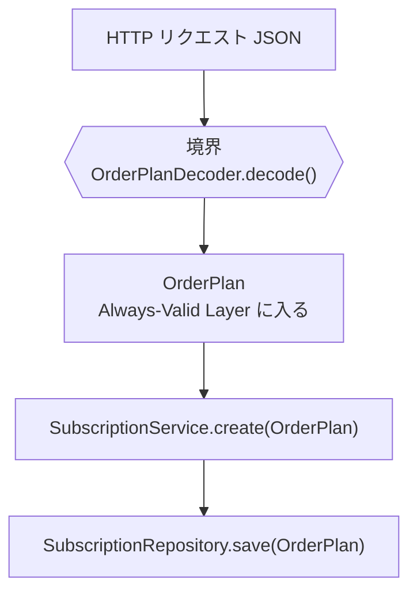

## 「ビジネスロジック」とは何か

古典ドメインモデリングパターンの文脈で「ビジネスロジックはドメイン層に置く」という言葉をよく聞きます。しかしいざ実装しようとすると、「これはビジネスロジックか？」という疑問が生まれます。

- 注文の合計金額を計算する → ビジネスロジック？
- 配送先住所のフォーマットを検証する → ビジネスロジック？
- データベースから注文を取得する → ビジネスロジックではない？
- 消費税率を掛ける → ビジネスロジック？

「ビジネスロジック」という言葉は、何が含まれるかを明確に定義しません。よく見られる説明は「UIや永続化に関係しない処理」という**否定形の定義**です。否定形で定義された概念は境界が曖昧で、同じコードを見て「これはビジネスロジックだ」「いや、インフラ層の責務だ」という議論が起きます。

## Always-Valid Layerという切り口

「ビジネスロジック」の代わりに使いたい概念が **Always-Valid Layer** です。

Always-Valid Layerとは、**そこに存在するデータは業務上常に正しい**という保証を持つ層のことです。言い換えると、この層に入ってくるデータは「検証済み」であり、null チェックや形式チェックを毎回やり直す必要がありません。

この定義は肯定形です。「何がある層か」が明確に言えます。

### Always-Valid Layer が保証する「正しさ」の範囲

ただし、ここで言う「正しさ」には二つのレベルがある点に注意が必要です。

| 正しさの種類 | 例 | 検査する場所 |
| --- | --- | --- |
| 形式的正当性 | 型が適切、必須フィールドが揃っている、日付形式が正しい、値域に収まっている | デコーダ（境界） |
| 業務的正当性 | 在庫が足りる、与信枠内である、重複注文ではない、配送可能エリアに届く | 振る舞いクラス・ドメインサービス（境界より内側） |

Always-Valid Layer は「**形式的正当性が保証された**データだけが入ってくる層」を意味します。業務的正当性——在庫が足りているか、与信枠を超えていないか、過去に同じ注文を受けていないか——は、境界を越えた後のドメイン処理で検査します。

「Always-Valid なら何も検証しなくていい」という意味ではありません。Always-Valid であっても **業務制約違反は起こりえます**。たとえば `CustomPlan` に食材を 100 個指定するリクエストが来たとき、デコーダは `List<MealId>` として受理できても、業務ルールとして「1プランあたり上限20品」を課しているなら、それは振る舞いクラスで検査することになります。

```java
// 業務的正当性の検証例: 振る舞いクラスで行う上限チェック
public class SubscriptionBehavior {

    private static final int MAX_CUSTOM_MEALS = 20;

    public Subscription.Active create(OrderPlan plan, UserId userId, LocalDate nextDeliveryDate) {
        // 業務ルール: カスタムプランは20品まで
        if (plan instanceof OrderPlan.CustomPlan custom
                && custom.meals().size() > MAX_CUSTOM_MEALS) {
            throw new BusinessRuleViolationException(
                "カスタムプランに指定できる食材は最大 " + MAX_CUSTOM_MEALS + " 品です");
        }
        // ここに来た時点で形式的正当性は型が保証しており、業務制約も満たしている
        return new Subscription.Active(
                new SubscriptionId(UUID.randomUUID().toString()),
                userId, plan, plan.frequency(), nextDeliveryDate);
    }
}
```

形式的正当性（型が保証）と業務的正当性（振る舞いクラスが検査）は実行のタイミングが異なります。前者は境界を越えた瞬間に確定し、後者はドメイン処理の中で逐次確認されます。

4章末尾の3種類の検証テーブル（フォーマット検証・存在確認・ビジネスルール検証）は、この二つの正当性を実行タイミング順に並べたものです。「形式的正当性」はフォーマット検証と存在確認、「業務的正当性」はビジネスルール検証に対応します。

ミールス宅配サービスで考えてみましょう。以下のメソッドを見てください。

```java
// Always-Valid Layer の外側（バリデーション前）
public void createSubscription(String planType, String mealSetId, String frequency) {
    if (planType == null) throw new IllegalArgumentException("planType is required");
    if (!planType.matches("STANDARD|PREMIUM|CUSTOM")) throw new IllegalArgumentException("invalid planType");
    if (mealSetId == null || mealSetId.isBlank()) throw new IllegalArgumentException("mealSetId is required");
    // ... バリデーションが続く
    
    // やっと本来の処理
}
```

これが **Shotgun Parsing** アンチパターンです。呼ばれるたびに入力の正当性を確認するコードが散弾（shotgun）のように各所に散らばります。たとえば `mealSetId` が空でないことの確認だけで、Controller・Service・Repository の入口付近に同じガード節が何箇所も現れます。バリデーションルールが変わったとき、すべての箇所を探して修正しなければならず、漏れがあっても気づきにくいです。

対して Always-Valid Layer の中はこうなります。

```java
// Always-Valid Layer の内側（パース済み）
public String createSubscription(OrderPlan plan) {
    // plan は OrderPlan 型。型の不変条件が正当性を保証している。
    // ここでは plan が valid であることを前提に処理を書ける。
    return subscriptionRepository.save(plan);
}
```

`OrderPlan` は sealed interface であり、`StandardPlan | PremiumPlan | CustomPlan` のどれかです。それぞれのレコードのコンストラクタが不変条件を保証しているので、このメソッド内で再チェックする必要はありません。

## 境界はどこか

Always-Valid Layerの境界は「入力をパースしてドメインモデルに変換する場所」です。



境界の外側では `JsonNode` や `String` を扱います。境界を越えた瞬間から `OrderPlan` を扱います。以降の処理はすべて型の保証の上に立てます。

この構造は「バリデーションはどこでやるか」という議論に答えを与えます。**バリデーションは境界でやります。境界の内側では型が保証します。** バリデーションを「ドメイン層に置くかどうか」ではなく、「どこが境界か」として考えれば良いです。

## Always-Valid Layer と「ビジネスロジック」の違い

「ビジネスロジック」はロジックの**種類**で分類しようとします。Always-Valid Layerはデータの**状態**で分類します。

| | ビジネスロジック層 | Always-Valid Layer |
| --- | --- | --- |
| 定義 | UIや永続化に関係しない処理（否定形） | 常に正しいデータを扱う層（肯定形） |
| 境界の決め方 | 感覚・慣習に依存 | パースが完了する場所 |
| バリデーションの位置 | 議論が起きやすい | 境界（層の入口）で行います |
| 防御的プログラミング | 必要になりやすい | 不要（型が保証） |

Always-Valid Layerという概念を使うと、「このチェックはドメイン層に書くべきかサービス層に書くべきか」という議論が不要になります。**チェックは境界で一度だけ行い、型に変換したら以降は型を信頼します。**

---

次章では、この境界を「状態遷移」として表現する方法を扱います。ミールス宅配サービスの定期便管理（アクティブ/一時停止）は、Always-Valid Layerの考え方を状態ごとに適用した実例です。
