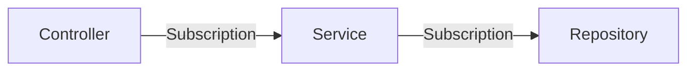
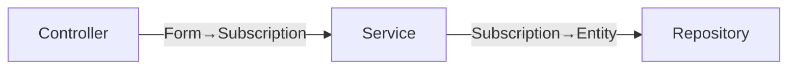
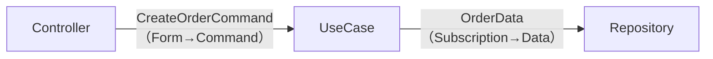
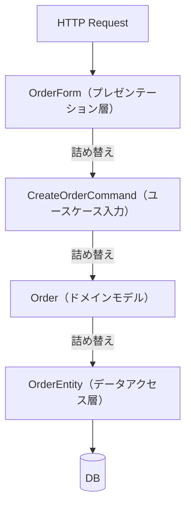

## 「詰め替え」とは何か

レイヤードアーキテクチャで実装されたSpring Bootアプリケーションを読んでいると、データを「詰め替え」するコードが頻出します。

```java
// Controller → Service への詰め替え
OrderInput input = new OrderInput();
input.setUserId(form.getUserId());
input.setPlanType(form.getPlanType());
input.setMealSetId(form.getMealSetId());
// ...
service.createOrder(input);
```

```java
// Service → Repository への詰め替え
SubscriptionEntity entity = new SubscriptionEntity();
entity.setId(subscription.getId().value());
entity.setUserId(subscription.getUserId().value());
entity.setStatus(subscription.getStatus().name());
// ...
repository.save(entity);
```

このような詰め替えが何層にも重なると、コードの大半が「あるオブジェクトから別のオブジェクトへ値をコピーする」作業になります。*Get Your Hands Dirty on Clean Architecture*（邦訳：手を動かしてわかるクリーンアーキテクチャ）ではこれを「マッピング戦略」として整理しています。

### 本書での「詰め替え回数」の数え方

本書は詰め替えの多寡を議論するときに、次のルールで数えます。曖昧さを避けるために明示しておきます。

- **1回と数えるもの**: **型が変わる操作**。`OrderPlanForm` → `CreateOrderCommand` のようにクラスが変わる詰め替え、リポジトリ実装内で `Subscription` を jOOQ の DSL（INSERT 文）に流し込む操作など。
- **0回と数えるもの**: ORM がテーブル列と Java フィールドを自動でマッピングする部分（`@Entity` がドメインモデルを兼ねている場合）。ドメイン内で同じ型のまま受け渡すだけの引数パス。

この定義に従うと、1章・2章で「3回」と述べた古典パターンの内訳は次のとおりです。

- `OrderPlanForm` → `CreateOrderCommand`（Controller）: **1回**
- `CreateOrderCommand` → `Subscription`（ApplicationService）: **1回**
- `Subscription` → テーブル列（JPA 自動マッピング）: **0回**（型変換をコードで記述しない）

合計 **2回** です。1章・2章では「JPA の自動マッピング」も含めて「3回」と表現しましたが、これは「コードのあちこちで詰め替えが発生している」という感覚的な問題提起でした。本章以降は上記の定義で統一します。11章で示す本書の構成も同じ定義で数えて2回であり、古典パターンの2回と回数は同じです。本書の構成が優れているのは回数ではなく、**詰め替えの置き場所が集約されている**点にあります。

## 3つのマッピング戦略

マッピング戦略は「型をレイヤー間でどの程度共有するか」によって大きく3つに分類できます。それぞれトレードオフがあり、プロジェクトの規模や開発体制によって適切な選択は変わります。

### No Mapping

レイヤー間でモデルを共有し、詰め替えをしません。



Ruby on Railsが代表例です。ActiveRecordオブジェクトがControllerからViewまで素通りします。変更が速い反面、ドメインモデルがHTTPレスポンスの形やテーブル構造に引きずられます。

### 2-way Mapping

各レイヤーが独自のモデルを持ち、隣接するレイヤーとの境界で詰め替えます。



Spring MVC ベースのレイヤードアーキテクチャで一般的に採用される戦略です（TERASOLUNA フレームワークのガイドラインはこの構成に近い設計を示しています）。プレゼンテーション層はFormクラス、ドメイン層はドメインモデル、データアクセス層はEntityクラスを持ちます。詰め替えは境界で発生しますが、各レイヤーの変更が他のレイヤーに波及しません。

### Full Mapping

各レイヤーが独自のモデルを持ち、さらにレイヤー間のやり取りに専用のモデル（DTO）を使います。



クリーンアーキテクチャの実装例でよく見られます。UseCase境界に `Command` オブジェクトや `ResponseModel` を置くパターンです。モデルの数が最も多く、詰め替えのコードも最も多いです。

## Full Mapping が価値を持つ条件

Full Mapping は、UseCase の入出力を安定した「契約」として固定することが目的です。たとえば、REST と gRPC の両方から注文を受け付けるシステムを考えてみます。REST 用の Controller と gRPC 用の Controller がそれぞれ `CreateOrderCommand` を組み立て、UseCase に渡します。プレゼンテーション層の形式が変わっても `CreateOrderCommand` の構造が変わらない限り、UseCase には変更が及びません。

この独立性が成立するのは、**`CreateOrderCommand` 自体の構造が安定しているとき**です。新しいフィールドを追加する場合は `CreateOrderCommand` も変更が必要になりますが、その変更を吸収するのが UseCase ではなく、REST/gRPC それぞれのアダプターになります。複数チームが並行して開発する大規模システムや、レイヤーを別々にデプロイするシステムではこの分離が大きな価値を持ちます。

しかし、この独立性のコストは詰め替えコードの増加です。

## 「過剰に見えるクリーンアーキテクチャ」の正体

Qiita や Zenn でよく見かける「Spring Boot + クリーンアーキテクチャ」の記事で、「詰め替えが多すぎる」という批判を目にすることがあります。その正体は多くの場合 Full Mapping です。



4種類のオブジェクトと3回の詰め替えが発生します。シンプルなCRUDアプリケーションでこれをやると、ほとんどのコードが詰め替えになります。

Full Mapping が意味を持つのは、**レイヤー間の独立性を強く保ちたい大規模システム**です。UseCase の入出力を安定した契約として固定し、プレゼンテーション層とドメイン層を完全に独立して変更できるようにしたい場合に有効です。しかし単一チームが同一コードベースを管理するWebアプリケーションでは、詰め替えの手間に対して得られる独立性の恩恵は小さくなります。

## どの戦略を選ぶか

戦略の選択は「レイヤー間の距離」で決まります。この考え方は次章で詳しく説明しますが、ここでは判断の目安を示します。

| 状況 | 適した戦略 |
| --- | --- |
| 小〜中規模、チームが同じコードベースを触る | No Mapping または 2-way Mapping |
| プレゼンテーション層とドメイン層を別チームが担当 | 2-way Mapping |
| ドメイン層とデータアクセス層を疎結合に保ちたい | 2-way Mapping |
| マイクロサービス間の境界 | Full Mapping（契約結合） |

ミールス宅配サービスのような一般的なWebアプリケーションでは、2-way Mapping で十分なことが多いです。3〜8章で構築したアーキテクチャはこれに相当します。

- **Controller → Domain**: `OrderPlanDecoder` が `JsonNode` → `OrderPlan` に変換（1回の詰め替え）
- **Domain → DB**: リポジトリ内で `Subscription` → jOOQのDSLに変換（1回の詰め替え）
- **Domain → HTTP レスポンス**: エンコーダが `Subscription` → `Map<String, Object>` に変換（1回の詰め替え・11章で詳述）

`CreateOrderCommand` のような中間オブジェクトは存在しません。入口・出口いずれの変換もドメイン型とドメイン外の形式の間でだけ起き、ドメイン層の内部ではドメイン型がそのまま受け渡されます。

---

次章では、「詰め替えが多い・少ない」という実装パターンの観点ではなく、「結合が強い・弱い」という別の概念的な軸から、同じ設計構成を評価します。
