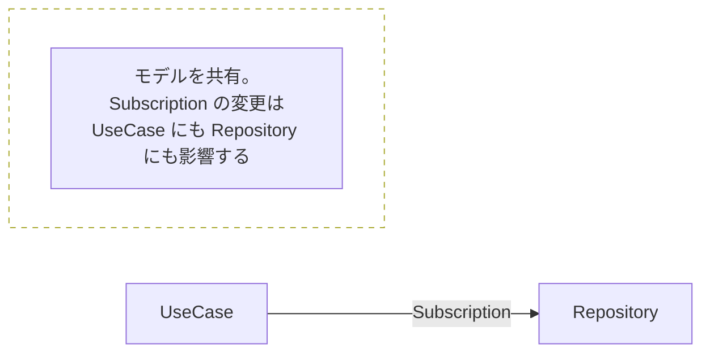
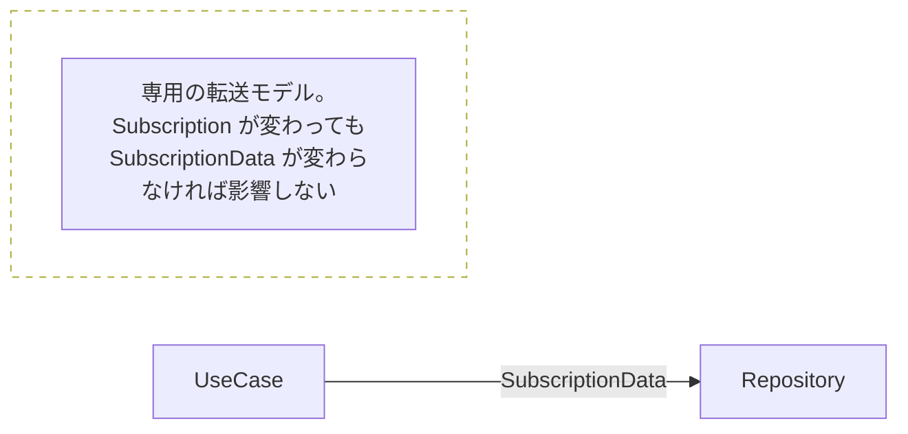
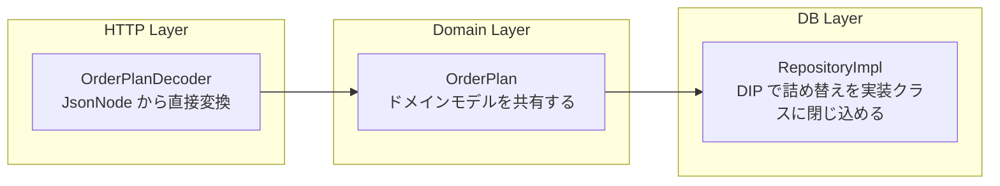

## なぜ「詰め替えをなくす」だけでは不十分か

前章で3つのマッピング戦略を整理しました。「詰め替えを減らしたい」という直感は正しいです。しかし「減らす＝常によい」とは言い切れません。詰め替えを無理に省いた結果、レイヤー間の依存が強くなりすぎることがあります。

*Balancing Coupling in Software Design* は、この問題を「結合強度」と「距離」という2つの軸で整理しています。

ここで、前章の分類との関係を整理しておきます。前章で示した No Mapping・2-way Mapping・Full Mapping は、「何回詰め替えるか」という**実装パターンの分類**です。これに対して本章で導入する「モデル結合」と「契約結合」は、レイヤー間の依存の強さを評価する**概念的な軸**です。2つの分類は独立しており、たとえば 2-way Mapping はモデル結合として実装することも契約結合として実装することもできます。本書の推奨構成（2-way Mapping + DIP）は、モデル結合の一形態です。

## 結合強度：モデル結合と契約結合

Balancing Coupling では、モジュール間の統合強度として次の2種類を区別します。何を共有するかによって、変更の波及範囲がどう変わるかが変わります。

### モデル結合（Model Coupling）

モジュール間でドメインモデルを直接共有します。詰め替えが不要な反面、一方のモデル変更が他方に直接波及します。



### 契約結合（Contract Coupling）

モジュール間のやり取りに専用のモデル（DTO）を使います。変更の波及を抑えられますが、モデルの数と詰め替えの量が増えます。



Full Mapping は契約結合を各レイヤー間で適用した結果です。モデルの数が最も多く、変更の影響が最も局所化されます。

## 距離：近ければ強い結合でも問題ない

Balancing Coupling のもう一方の軸が「距離」です。距離とは、2つのモジュールを同時にメンテナンスできるかどうかの尺度です。

- **距離が近い**: 同じ人が同じタイミングで変更できます（同一チーム、同一リポジトリ）
- **距離が遠い**: 異なるチームが独立して変更します（別チーム、別リポジトリ、マイクロサービス間）

| 結合強度 | 距離が近い | 距離が遠い |
| --- | --- | --- |
| モデル結合（強い） | バランスが取れています | 危険です |
| 契約結合（弱い） | 過剰な可能性があります | バランスが取れています |

距離が近ければ、強い結合（モデル結合）でもバランスが取れています。UseCase と Repository が同じチームの同じリポジトリにあるなら、Subscription モデルを共有していても、変更が波及したときに両方を同時に直せます。ただし、同一リポジトリであっても開発チームが分かれている場合や、将来的に別サービスに切り出す計画がある場合は、距離が実質的に遠い状態として扱うことを検討してください。このグレーゾーンの判断基準は13章で補足します。

距離が遠い場合は、契約結合が必要になります。マイクロサービス間でドメインモデルを直接共有してしまうと、一方のサービスの変更が他方のサービスを壊します。この境界には専用の転送モデルが必要です。

### 距離は時間とともに変わる

ここまでは現時点の距離を静的に評価しました。実際の設計では、距離は時間とともに変化します。判断するときは 6〜12 ヶ月のスパンで次の3点を見込みに入れます。

- **組織のスケール**: チームが分割される、外注パートナーが入る、といった見込みがあるか
- **モジュール切り出し**: いまは単一デプロイだが、特定のモジュールをサービスとして切り出す計画があるか
- **外部公開**: 将来的に API を社外に公開する、SDK を配布する、といった予定があるか

これらに**具体的なロードマップがある場合**は、現在の距離が近くても契約結合を選ぶ判断はあり得ます。過剰設計ではなく、見えている変化への先行投資です。

逆に「将来どうなるか分からない」というレベルの不確定予測で契約結合を選ぶのは、詰め替えコストに対して得られる独立性が見合わない傾向があります。13章の「過剰設計としての契約結合」とも合わせて、**ロードマップの具体性**を判断材料にしてください。

通常のレイヤードアーキテクチャでは、上位層が下位層を呼び出します。詰め替えの責務は呼び出し側（上位層）にあります。

```java
// UseCase が Repository を直接呼び出す構成
public class SubscriptionUseCase {
    public void suspend(String id) {
        Subscription.Active active = findActive(id);
        Subscription.Suspended suspended = behavior.suspend(active);

        // UseCase が詰め替えの責務を持つ
        SubscriptionEntity entity = toEntity(suspended);
        entityRepository.save(entity);
    }
}
```

DIP（Dependency Inversion Principle）を使うと、依存の方向が逆転し、詰め替えの責務も逆転します。

```java
// UseCase はインターフェース（抽象）に依存する
public class SubscriptionUseCase {
    private final SubscriptionRepository repository; // interface

    public void suspend(String id) {
        Subscription.Active active = repository.findActive(id);
        Subscription.Suspended suspended = behavior.suspend(active);

        // UseCase はドメインモデルをそのまま渡す
        repository.save(suspended);
    }
}

// インターフェース：ドメインモデルで定義
public interface SubscriptionRepository {
    Subscription.Active findActive(SubscriptionId id);
    void save(Subscription subscription);
}

// 実装クラス：ドメイン層の外に置かれ、詰め替えの責務を持つ
public class SubscriptionRepositoryImpl implements SubscriptionRepository {
    public void save(Subscription subscription) {
        switch (subscription) {
            case Subscription.Active a -> jooq.insertInto(SUBSCRIPTIONS)
                    .set(SUBSCRIPTIONS.STATUS, "ACTIVE")
                    .set(SUBSCRIPTIONS.NEXT_DELIVERY_DATE, a.nextDeliveryDate())
                    // ...
                    .execute();
            // Suspended には nextDeliveryDate フィールドがないため、
            // NEXT_DELIVERY_DATE 列はセットしない（DB 側の DEFAULT NULL に任せる）
            case Subscription.Suspended s -> jooq.insertInto(SUBSCRIPTIONS)
                    .set(SUBSCRIPTIONS.STATUS, "SUSPENDED")
                    // ...
                    .execute();
        }
    }
}
```

UseCase はドメインモデルのみを知ります。詰め替えは `SubscriptionRepositoryImpl` の中に閉じ込められます。UseCase の変更と永続化の変更が互いに影響しません。

## ミールス宅配サービスへの適用

ミールス宅配サービスは単一チームが単一リポジトリで管理する Web アプリケーションです。レイヤー間の距離は近いです。

この条件では、2-way Mapping + DIP の構成がちょうどよいです。



[近い距離・強い結合でも許容]

- **HTTP Layer → Domain Layer**: Raoh の `OrderPlanDecoder` が `JsonNode` を `OrderPlan` に変換します。この1回の詰め替えで済みます。
- **Domain Layer → DB Layer**: `SubscriptionRepositoryImpl` が `Subscription` を jOOQ の DSL に変換します。DIP により、UseCase は詰め替えを知りません。

`CreateOrderCommand` のような中間 DTO は存在しません。距離が近いので、モデル結合で十分なバランスが取れています。

---

次章では、この設計を注文フロー全体で見渡します。JSON 入力からドメイン record を経て jOOQ で永続化するまでを通しで追い、「変換が一回で済む理由」を確認します。
