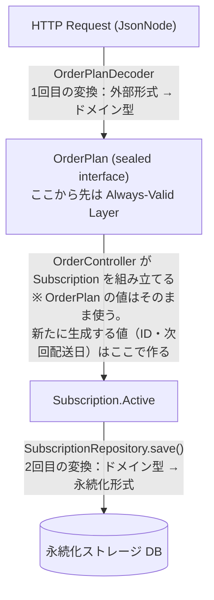
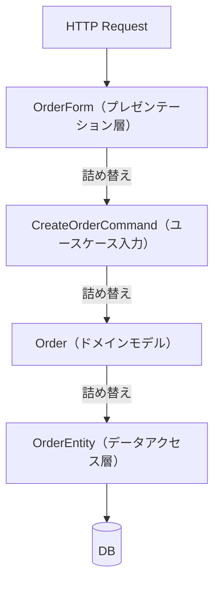
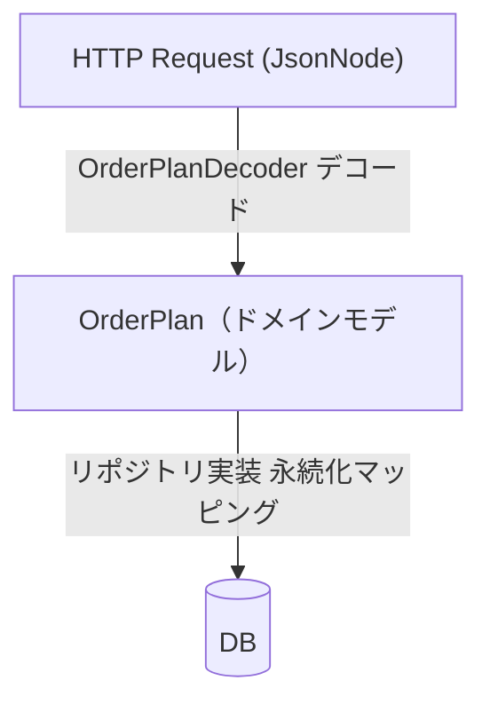
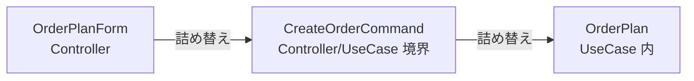
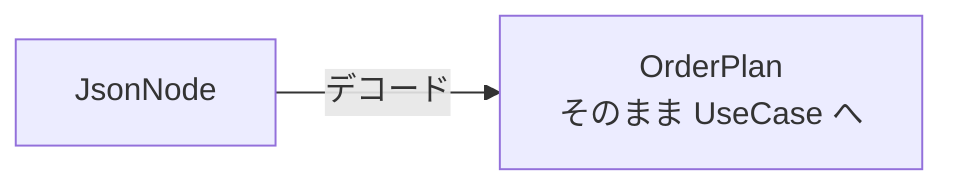

## 注文フロー全体を通して見る

3〜8章で個別に見てきたデコーダと状態遷移を、今度はレイヤーを縦断して追います。HTTP リクエストが届いてから DB に書き込まれるまで、データがどのように変換され、どこで変換が起きるかを一覧します。



「変換」とここで指しているのは、**あるドメイン型を別のドメイン型や永続化形式に写し替える操作**です。Controller で `UUID.randomUUID()` や `LocalDate.now().plusWeeks(1)` を生成するのは「値の生成」であり、変換ではありません。`OrderPlan` から `Subscription.Active` を作るときも、`plan` をそのままフィールドに渡しているだけで、型を変換する詰め替えは発生していません。Full Mapping で現れる `CreateOrderCommand` や `OrderData` のような中間 DTO は存在しません。

> **IDの採番と次回配送日の計算について**  
> `UUID.randomUUID()` によるID採番は Controller が担っていますが、これは「誰がIDを採番するか」という設計判断です。IDの採番をドメイン層（`SubscriptionBehavior`）や Application Service に移動させることもできます。  
> `LocalDate.now().plusWeeks(1)` という「1週間後」の計算は業務ルールです。本サンプルでは Controller に直接書いていますが、実際のアプリケーションではこのような業務ルールを Application Service か `SubscriptionBehavior` に寄せ、Controller を HTTP の入出力処理に集中させる設計が望ましいです。本章では「デコーダとリポジトリの接続経路」を示すことに絞っているため、この詳細は省略しています。

## 入口：@RequestBody JsonNode

Controller は `@RequestBody JsonNode` で受け取ります。

> **注: ユーザーIDの取得について**  
> 以降のサンプルコードでは `extractUserId(body)` というヘルパーで UserId を取得しています。実際のアプリケーションでは、ユーザーIDをリクエストボディから取得すべきではありません。リクエストボディにユーザーIDを含めると、クライアントが任意のIDを送り込めるなりすましの危険があります。本来は Spring Security の `SecurityContextHolder` または `@AuthenticationPrincipal` アノテーションを通じて、認証済みユーザーのIDを取得します。本書ではこのコードを「デコーダとリポジトリの接続」を示すことに集中するため、認証の詳細を省略しています。

```java
@PostMapping
public ResponseEntity<?> createOrder(@RequestBody JsonNode body) {
    Result<OrderPlan> result = OrderPlanDecoder.ORDER_PLAN_DECODER.decode(body);

    return switch (result) {
        case Ok<OrderPlan> ok -> {
            OrderPlan plan = ok.value();
            Subscription.Active subscription = new Subscription.Active(
                    new SubscriptionId(UUID.randomUUID().toString()),
                    extractUserId(body),  // ※実際の実装では Spring Security の Authentication からIDを取得する
                    plan,
                    plan.frequency(),
                    LocalDate.now().plusWeeks(1)
            );
            subscriptionRepository.save(subscription);
            yield ResponseEntity.status(201).build();
        }
        case Err<OrderPlan> err ->
                ResponseEntity.badRequest().body(err.issues());
    };
}
```

デコーダが `Result<OrderPlan>` を返します。`Ok` なら型が確定した `OrderPlan` が手に入ります。`Err` なら構造化されたエラー情報が手に入ります。中間の `OrderForm` も `CreateOrderCommand` も存在しません。

`@Valid` アノテーションも `BindingResult` も不要です。デコーダ自体がバリデーションと型変換を同時に行います。

## 型の確定とパターンマッチ

`Ok` ブランチで得られる `plan` は `OrderPlan` 型ですが、`switch` を使えばプランの種類ごとに型が確定します。

```java
String description = switch (plan) {
    case OrderPlan.StandardPlan p ->
            "スタンダードプラン: " + p.mealSetId().value();
    case OrderPlan.PremiumPlan p ->
            "プレミアムプラン: " + p.mealSetId().value()
            + (p.includeFrozen() ? "（冷凍含む）" : "");
    case OrderPlan.CustomPlan p ->
            "カスタムプラン: " + p.meals().size() + "品";
};
```

コンパイラが網羅性を保証します。新しいプランの種類が追加されたとき、このコードはコンパイルエラーになります。実行時エラーとして現れる前に気付けます。

## 出口：リポジトリが詰め替えを担う

`subscriptionRepository.save(subscription)` の先は、リポジトリ実装が担います。Controller は詰め替えを知りません。

```java
// リポジトリ実装内の詰め替えロジック
@Override
public void save(Subscription subscription) {
    SubscriptionRow row = switch (subscription) {
        case Subscription.Active a -> toActiveRow(a);
        case Subscription.Suspended s -> toSuspendedRow(s);
    };
    store.put(row.id(), row);  // 実際の実装では jOOQ の DSL を使う
}

private SubscriptionRow toActiveRow(Subscription.Active a) {
    return buildRow(a.id().value(), a.userId().value(), "ACTIVE",
            a.plan(), a.frequency(), a.nextDeliveryDate());
}
```

実際のアプリケーションでは `store.put(...)` の部分が jOOQ の DSL になります。

```java
// jOOQ を使った場合の例（新規作成のみ示しています）
// 実際の save() が更新も担う場合は insertInto(...).onConflictDoUpdate() や
// MERGE 文を使い、INSERT/UPDATE を切り替えてください。
case Subscription.Active a -> jooq.insertInto(SUBSCRIPTIONS)
        .set(SUBSCRIPTIONS.ID, a.id().value())
        .set(SUBSCRIPTIONS.USER_ID, a.userId().value())
        .set(SUBSCRIPTIONS.STATUS, "ACTIVE")
        .set(SUBSCRIPTIONS.NEXT_DELIVERY_DATE, a.nextDeliveryDate())
        .execute();
```

ドメインモデルの `Subscription` は `@Entity` アノテーションを持ちません。jOOQ は `ResultSet` を直接 Java オブジェクトにマッピングするので、ORM のようにドメインモデル自体に永続化の知識を持たせる必要がありません。

## 1〜2章の構成との対比

1章で示した Full Mapping の構成と比較します。

**Full Mapping:**



4 種類のオブジェクト、3 回の詰め替え。

**本書の構成:**



2 種類のオブジェクト、2 回の変換。

（回数の数え方の定義は9章「本書での『詰め替え回数』の数え方」を参照してください。）

消えたものは何でしょうか。

- `OrderForm`: Bean Validation のためのフラットなクラスです。デコーダが `JsonNode` を直接 `OrderPlan` に変換するので不要です。
- `CreateOrderCommand`: UseCase の境界を明示するための Local DTO です。デコーダがあれば不要になります（後述）。
- `OrderEntity`: JPA のエンティティクラスです。jOOQ はドメインモデルから直接 DSL で SQL を発行できるので不要です。

削除したのではなく、それらの役割が別の場所に吸収されました。

- `OrderForm` の役割 → `OrderPlanDecoder`（デコーダが型変換とバリデーションを担う）
- `CreateOrderCommand` の役割 → `OrderPlan` が直接 UseCase に渡る（中間 DTO なし）
- `OrderEntity` の役割 → `SubscriptionRepositoryImpl` 内の `switch` 式（リポジトリが永続化マッピングを担う）

### なぜ `CreateOrderCommand` が不要になるのか

`CreateOrderCommand` のような Local DTO（UseCase 専用の入力クラス）が生まれる根本的な理由は、**Bean Validation のバリデーション結果が型に反映されない**ことにあります。

Bean Validation を通過した後のオブジェクトは `OrderPlanForm` のままです。`planType` は `String`、`mealSetId` も `String` のまま——ドメインの型（`OrderPlan`）ではありません。Controller がこの `OrderPlanForm` を UseCase に直接渡してしまうと、UseCase がプレゼンテーション層のクラス（`OrderPlanForm`）に依存することになります。それを避けるために `CreateOrderCommand` という中間の Local DTO が登場します。



Raoh のデコーダは `JsonNode` を受け取り、直接 `OrderPlan` を返します。`OrderPlanForm` という中間状態が存在しないので、そもそも「プレゼンテーション層の型を UseCase に渡してしまう」という問題が起きません。デコードの結果はすでにドメイン型なので、`CreateOrderCommand` を経由する理由がなくなります。



Local DTO がなくなることで、フィールドを1つ追加したときの修正箇所が減ります。2章で示した「フィールド追加が複数クラスに波及する」問題の一因がここにあります。

---

本章のまとめ: 詰め替えは「なくす」のではなく「適切な場所に集める」ものです。境界（入口）ではデコーダが一回変換し、型を確定させます。内部（ドメイン層）ではドメインモデルをそのまま扱います。出口（リポジトリ実装）ではドメインモデルを永続化形式に変換します。この配置が、変更の波及を最小にしながら、詰め替えの総量も最小にします。

次の12〜13章では、こうした設計を既存のコードベースにどう導入するか、また設計判断の基準をどう立てるかを扱います。
