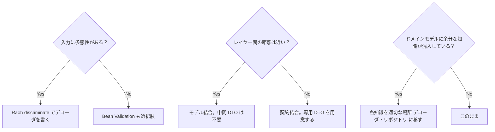

## 「ちょうどいい設計」を測る3つの問い

本書を通じて繰り返し登場した判断基準をまとめます。設計の選択に迷ったとき、この3つの問いに答えることで「重すぎる設計」と「軽すぎる設計」のバランスを見つけられます。

---

## 問い1: 入力に多態性があるか

**Yes → Raoh デコーダ**
**No → Bean Validation（も選択肢に入る）**

プランの種類ごとにフィールドが異なる、状況によって必須フィールドが変わる——そういった多態性がある入力には、Raoh の `discriminate` が強みを発揮します。デコーダが型を確定させ、その後のコードはコンパイラの保証の上で動きます。

多態性がない単純な入力（名前・メールアドレスだけを受け取るフォームなど）では、Bean Validation の簡潔さが有利な場合もあります。

| 入力の性質 | 適したアプローチ |
| --- | --- |
| フラットで単純（フィールドが全ケースで共通） | Bean Validation |
| プランや種類によってフィールドが変わる | Raoh `discriminate` |
| 外部からの非構造データ（JSON API など） | Raoh（JsonNode を直接受け取る） |

実務上は、最初はプランが1種類だったものが運用後に種類が増えるケースや、オプション項目が追加されてフィールドの必須条件が分岐するケースが起こりえます。そういった拡張が見込まれる場合、Raoh を使っておくと型安全に対応できます。

---

## 問い2: レイヤー間の距離は近いか

**距離が近い → モデル結合（DTO なし）で十分**
**距離が遠い → 契約結合（専用 DTO）を検討する**

同一チームが同一リポジトリで管理している Controller と UseCase の間に `CreateOrderCommand` を置く必要はありません。同時に変更できるなら、モデル結合で十分です。

距離が遠くなるケースは次のとおりです。

- **マイクロサービス間**: 別サービスが独立してデプロイされます。API の変更を双方が調整する必要があります。
- **チームが分かれている**: プレゼンテーション層とドメイン層が別チームの担当です。
- **外部公開 API**: 外部クライアントが依存している API スキーマです。変更の影響が外部に波及します。

こうした距離がある場合は、契約結合（専用 DTO）が適切です。ただし「もしかしたら将来的に別チームになるかもしれない」という仮定で契約結合を選ぶのは過剰設計です。現状の距離で判断します。

なお、同一リポジトリに複数チームが存在するケース（例：モノレポ構成でフロントエンドチームと API チームが共存する）では、物理的な距離（リポジトリ）と組織的な距離（チーム）が乖離します。この場合は組織的な距離を優先し、チームをまたぐ境界では契約結合を選択します。同じチームが担当するモジュール間であればモデル結合でも問題ありません。判断の軸は「同時に変更できるか」よりも「変更のコミュニケーションコストが低いか」です。

将来的に距離がどう変わるかの見立てについては、10章「距離は時間とともに変わる」を参照してください。具体的なロードマップがある場合には、現在の距離が近くても先行投資として契約結合を選ぶ判断がありえます。

---

## 問い3: ドメインモデルに余分な知識が混入していないか

**永続化の知識が混入している** → リポジトリ実装に移す
**バリデーションの知識が混入している** → デコーダ（境界）に移す

`@Entity` や `@Column` がドメインモデルに付いていたら、永続化の知識が混入している証拠です。`@NotNull` や `@Size` が付いていたら、バリデーションの知識が混入しています。

ドメインモデルが「ただの record」であれば、Spring Context なしに単体テストが書けます。JPA の設定なしに、ドメインロジックのテストだけを高速に実行できます。「テストのしやすさ」は設計のよさのバロメーターです。

---

## 判断基準の全体像

---

設計の問題は「詰め替えの量」か「レイヤー間の依存の強さ」か、2つの視点で顕在化します。それぞれ対処法が異なるため、どちらの症状かを見極めることが大切です。

## 詰め替えコードが増えすぎていると感じたら

次のような状況が重なっているとき、マッピング戦略を見直すきっかけになるかもしれません。

- Controller → UseCase → Domain → Repository のすべての境界で DTO が存在し、詰め替えコードが大半を占めている
- ドメインモデルに `@Entity`、`@NotNull`、状態チェックの `if` がすべて存在している
- シンプルな CRUD に `CreateOrderCommand` と `OrderData` の両方が存在している
- ドメインモデルのテストに Spring Context が必要になっている

これらが重なっている場合、Full Mapping を意識せずに採用してきた可能性があります。

---

## 層をまたいだ依存が増えてきたと感じたら

反対に、レイヤー間の距離が近すぎることで起きやすい状況もあります。

- ActiveRecord パターンで、プレゼンテーション層がドメインモデルを直接 JSON シリアライズしている（ドメインモデルとプレゼンテーション層の責務が混在している状態です）
- バリデーションが複数のメソッドに散らばっていて、同じチェックが重複している（Shotgun Parsing）
- テーブルが変わるたびにドメインモデルの変更が波及する（距離が遠いのにモデル結合している）

---

## まとめ

本書が示した設計の中心にある考え方は、「知識を適切な場所に置く」です。

- バリデーションと型変換の知識は **境界（デコーダ）** に
- 状態遷移の知識は **振る舞いクラス** に
- 永続化の知識は **リポジトリ実装** に

ドメインモデルはその構造だけを表現します。バリデーションも永続化も状態チェックも知らない「ただの record」です。

この分離が実現できたとき、次の変更が最も楽になります。プランの種類が増えたとき、デコーダを追加し、sealed interface に permits を追加します。永続化の方法が変わったとき、リポジトリ実装だけを書き換えます。プレゼンテーション層の要件が変わったとき、Controller 側のデコーダだけを調整します。

「古典ドメインモデリングパターン」が課していた制約——ドメインモデルが永続化・バリデーション・状態管理のすべてを背負う——から解脱することが、この本の目的でした。

---

## 本書を終えて

本書で示した設計は、銀の弾丸ではありません。距離が遠いレイヤー境界では契約結合が必要ですし、既存のコードベースが Bean Validation と JPA に強く寄っていれば、そのままの構成で戦う判断もあります。本書の狙いは「この形に揃えてください」という正解の提示ではなく、**どの軸で設計を評価するか**——型による安全性、知識の配置、結合と距離のバランス——を読者の判断材料として残すことにあります。

実際にプロジェクトへ適用するときは、12章で示した段階的な導入が現実的です。Controller 直後にデコーダを一つ挟むところから始め、効果を確かめながら少しずつ広げてください。型が保証してくれる範囲が広がるにつれ、テストで書いていた防御的な検査や、レビューで指摘していた暗黙の前提が、コードからすっと消えていくはずです。その静けさが、関心を分離した設計が届ける最も分かりやすい成果です。
